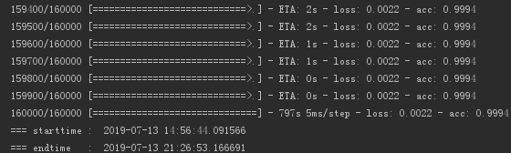

# dga_detect_with_lstm

# 功能
- 构建深度学习模型对dga模型进行检测

# dga
近年来, 僵尸网络控制者为了躲避打击、确保僵尸网络控制通道畅通, 普遍采用一种名为DGA（Domain Generation Algorithm）的域名生成算法。
采用这种算法后, 黑客主机不再使用唯一的固定域名, 而是在不同时间生成多组域名, 黑客只需提前注册其中的部分域名, 即可实现对僵尸网络的完整控制。
由于不清楚DGA算法的实现细节, 网络安全防护人员很难提前预测出恶意域名信息, 对僵尸网络实施有效打击也就无从谈起。因此对DGA算法进行破解,
提前预测未来所有可能出现的域名信息, 对抑制僵尸网络, 打击此类犯罪有重要意义。

# 模型
- 整个模型如下所示：数据处理->Embedding->LSTM->attention_tanh->Flatten->Dropout->Dense->Activation->compile->fit
- dga_train.py对域名进行训练，dga_test.py对数据进行测试

# 训练结果

# 代码简介
- model：lstm模型构建，核心层
- test_data：测试数据
- train_data：训练数据
- dga_train.py对域名进行训练
- dga_test.py对数据进行测试

# 所依赖的主要lib
- tensorflow                  1.12.0
- Keras                       2.2.4
- python                      3.6.4

## 在跑的过程中遇到了问题，请联系
  邮箱：deamoncao@163.com
